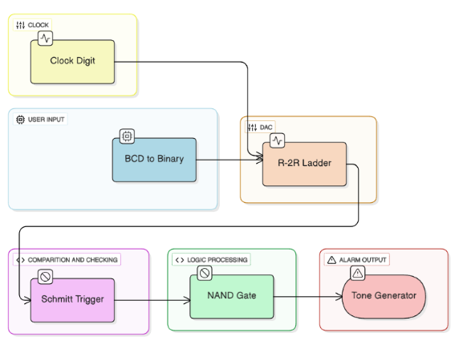
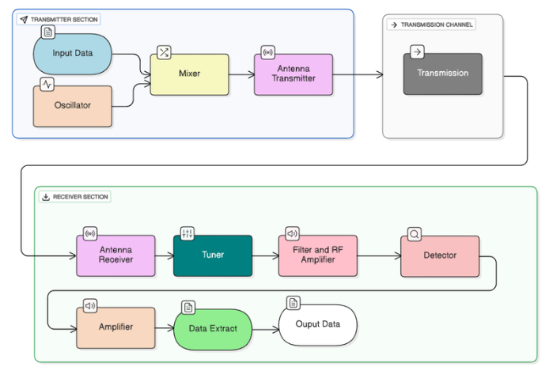
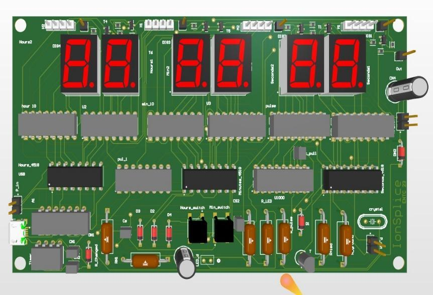
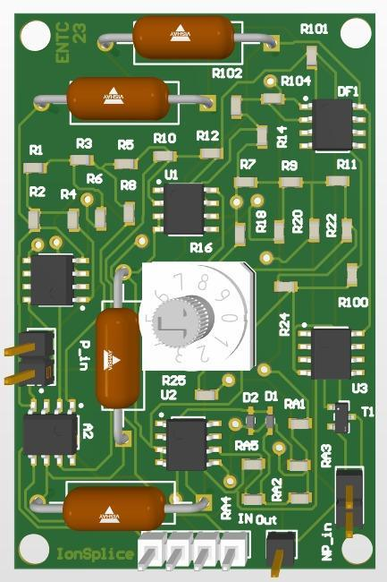
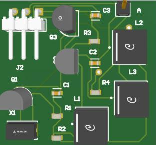
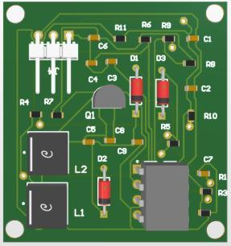
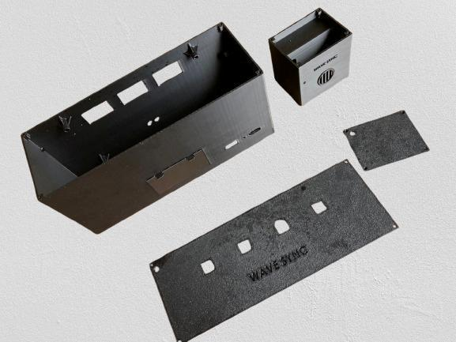
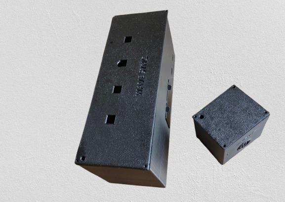

# WaveSync - RF-Linked Alarm Clock

<p align="center">
  
</p>

<p align="center">
  A hardware-only alarm system that broadcasts one alarm event to multiple remote receivers over a 433.92 MHz OOK radio link.
</p>

## Overview

WaveSync is a microcontroller-free, firmware-free alarm distribution system
developed by **Team IonSplice** for the University of Moratuwa EN2091 Laboratory
Practice and Project module.

The system consists of a **Master Unit** and one or more **Receiver Units**. The
Master Unit keeps time, accepts a user-selected alarm time, detects a match using
mixed digital and analog circuitry, and transmits an RF trigger. Every compatible
receiver within range detects the same broadcast and activates its local alarm.

WaveSync addresses a simple problem: a conventional alarm may not be audible in
another room, across a noisy workspace, or behind structural barriers. A single
master clock can instead distribute the alert wirelessly to several locations
with no network, application, pairing process, or software dependency.

## Highlights

- No microcontroller and no firmware
- 433.92 MHz one-way RF link using On-Off Keying (OOK)
- One transmitter can trigger multiple receiver units
- Hardware alarm-time comparison using BCD conversion, R-2R DACs, analog
  comparison, and discrete logic
- Digital clock display and four alarm-setting controls
- Approximately one-minute receiver alarm output
- Battery-powered, portable master and receiver prototypes
- Custom clock, DAC/comparator, transmitter, and receiver PCBs
- Custom master and receiver enclosures

## How it works

The design is divided into two signal paths.

### 1. Alarm detection

1. The clock circuit outputs the current time as digit data.
2. The user enters the alarm time using four controls: hours tens, hours ones,
   minutes tens, and minutes ones.
3. BCD-to-binary logic and R-2R ladders convert the clock and alarm values into
   analog levels.
4. The comparison chain evaluates the difference between the two values.
5. A Schmitt-trigger and NAND-logic stage produces a clean alarm event when the
   values match.

<p align="center">
  
</p>

### 2. RF distribution

The alarm event enables the 433.92 MHz OOK transmitter. Any WaveSync receiver
tuned to the carrier can recover the event, filter and amplify it, and drive its
local alarm output.

<p align="center">
  
</p>

## System units

### Master Unit

The Master Unit contains the clock, time-setting controls, alarm-setting
controls, comparison circuitry, and RF transmitter. It displays the current
time and initiates the wireless alarm event.

### Receiver Unit

The Receiver Unit continuously listens for the RF trigger and activates an
audible alarm when a valid event is received. It does not require a clock or
alarm-time configuration.

## Using the prototype

1. Insert the specified battery and switch on the Master Unit.
2. Set the current hour and minute using the time-setting controls.
3. Set the alarm using the four top-mounted digit controls.
4. Power each Receiver Unit and place it away from large metal objects and
   strong sources of RF interference.
5. When the clock reaches the alarm time, the Master Unit broadcasts the event
   and the receivers sound for approximately 60 seconds, unless manually
   stopped.

For complete instructions, see the [User Manual](docs/User_manual.pdf).

## Documented specifications

### System

| Parameter | Documented value |
| --- | --- |
| RF carrier | 433.92 MHz ISM band |
| Modulation | On-Off Keying (OOK) |
| Link direction | One-way broadcast |
| Receiver count | Multiple receivers; no pairing required |
| Typical indoor range | 20-60 m, environment dependent |
| Nominal outdoor line-of-sight range | Up to 100 m |
| Operating-temperature design range | -15 to 85 degrees C |

### Master Unit

| Parameter | Documented value |
| --- | --- |
| Supply | 5-12 V; prototype supports 9 V battery / USB-A supply |
| Idle current | 300 mA |
| Active current | 320 mA |
| Clock accuracy | 250 ppm |
| Alarm resolution | 1 minute |
| Documented alarm drift | +/-22 seconds/day |
| Power consumption | 1.5 W |
| Approximate weight | 300 g |

### Receiver Unit

| Parameter | Documented value |
| --- | --- |
| Receiver supply rail | 5 V; prototype powered from a 9 V battery |
| Idle current | 70 mA |
| Active current | 100 mA |
| Receiver sensitivity | -110 dBm |
| Alarm tone | 1 kHz |
| Sound level | 80-85 dB at 1 m |
| Alarm duration | 60 seconds, fixed |
| Power consumption | 0.3 W |
| Approximate weight | 100 g |

These are design and prototype values recorded in the project documents. RF
range, battery life, clock drift, and sound level depend on component tolerance,
antenna placement, supply condition, obstacles, and local interference.

## PCB design

The prototype was divided into functional PCBs for easier development and
testing.

| Clock PCB | DAC and comparator PCB |
| :---: | :---: |
|  |  |

| Transmitter PCB | Receiver PCB |
| :---: | :---: |
|  |  |

Editable PCB projects, schematics, fabrication outputs, and the bill of
materials can be placed under `hardware/` as they are prepared for publication.

## Enclosure

The master and receiver enclosures were designed to keep the units compact and
portable while providing access to the display, controls, battery compartment,
switches, alarm opening, and antennas.

| Enclosure parts | Final enclosure models |
| :---: | :---: |
|  |  |

## Additional photographs to add

The images above were extracted from the project report. Replace or supplement
them with higher-resolution originals when available:

| Photo slot | Suggested repository path |
| --- | --- |
| Final product - front view | `media/images/final-product/front.jpg` |
| Final product - rear and controls | `media/images/final-product/rear-controls.jpg` |
| Internal assembly and wiring | `media/images/final-product/internal-wiring.jpg` |
| Fabricated PCBs - top and bottom | `media/images/pcb/assembled-pcbs.jpg` |
| Enclosure fabrication or exploded view | `media/images/enclosure/fabrication.jpg` |
| RF range-test setup | `media/images/testing/range-test.jpg` |

After adding a photograph, insert it with standard Markdown:

```markdown

```

## Project documentation

- [Project Report](docs/Project_report.pdf) - motivation, architecture, circuit
  blocks, PCB designs, enclosure, final prototype, and task allocation
- [User Manual](docs/User_manual.pdf) - setup, time/alarm adjustment, placement,
  maintenance, safety, and operation
- [Product Datasheet](docs/Datasheet.pdf) - electrical, RF, timing, alarm,
  mechanical, and power specifications

## Repository structure

```text
wavesync-rf-alarm/
|-- README.md
|-- docs/
|   |-- Project_report.pdf
|   |-- User_manual.pdf
|   `-- Datasheet.pdf
|-- hardware/
|   |-- schematics/
|   `-- pcb/
|-- enclosure/
|-- media/
|   |-- images/
|   |   |-- architecture/
|   |   |-- enclosure/
|   |   |-- final-product/
|   |   |-- pcb/
|   |   `-- testing/
|   `-- videos/
`-- .gitignore
```

## Project context and team

WaveSync was developed for **EN2091: Laboratory Practice and Project** in the
Department of Electronic and Telecommunication Engineering, University of
Moratuwa.

**Team IonSplice**

- Ahamed A.M.S. - DAC and comparator design; PCB layout and design
- Hakam M.R.A. - transmitter and receiver circuits; PCB layout and design
- Manatunga K.D. - enclosure design and development
- Umair A. - clock circuit; PCB layout and design
- System concept, architecture, integration, and testing - team effort

### Repository author's contribution

**Abdul Hakam (Hakam M.R.A.)**

- Designed and developed the RF transmitter and receiver circuits
- Contributed to PCB layout and design using Altium Designer
- Supported system integration and prototype testing

## Future improvements

- Add push-to-talk capability
- Add visual or vibrating alert modules for users with hearing impairments
- Reduce power consumption with improved low-power circuitry
- Perform and publish repeatable indoor and outdoor RF range measurements
- Characterize false-trigger rate, latency, battery life, and long-term clock
  drift using documented test procedures
- Improve antenna integration and electromagnetic isolation inside the
  enclosure

## Safety and regulatory note

This prototype is intended for education and general alerting only. It is not a
medical, fire, security, or emergency-warning system. Use the specified power
source, keep the units dry, and comply with local regulations for operation in
the 433 MHz ISM band. Statements such as CE/FCC readiness in the project
documents are design goals and do not constitute certification.

## License

No open-source license has been selected. Unless the authors add a `LICENSE`
file, the project remains all rights reserved and is shared for educational
viewing only.
