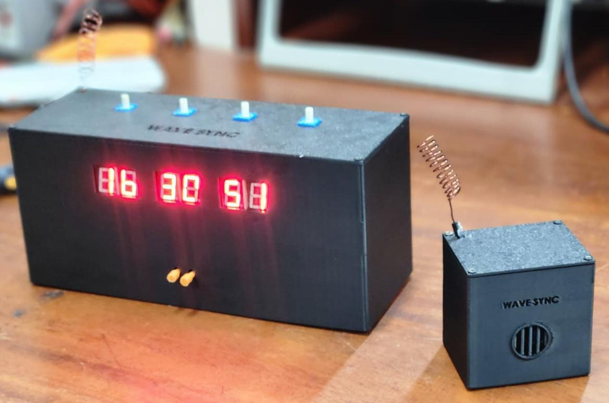

# WaveSync - RF-Linked Alarm Clock

> A microcontroller-free alarm clock that distributes an alarm trigger wirelessly to one or more remote receivers using 433 MHz On-Off Keying (OOK).

<!-- Replace placeholder text in square brackets before publishing. -->

## Overview

WaveSync was developed by **Team IonSplice** for the University of Moratuwa EN2091 Laboratory Practice and Project module.

The system uses hardware logic rather than firmware. The clock produces digitally encoded time data, while a mixed-signal comparison stage determines when the current time matches the user-set alarm. A 433 MHz transmitter then broadcasts the alarm trigger, allowing remote receivers to activate at approximately the same time.

## Problem Addressed

A conventional alarm may not be heard across separate rooms or noisy environments. WaveSync provides a low-cost one-to-many wireless alarm link so that a single clock can activate alarms at multiple locations.

## Key Features

- Microcontroller-free and firmware-free implementation
- Digital clock and user-set alarm input
- R-2R DAC and comparator-based alarm matching
- 433 MHz AM/OOK wireless transmission
- One transmitter can trigger multiple receivers
- Custom transmitter, receiver, clock, and comparison PCBs
- Custom enclosure for the clock and remote receiver

## System Operation

1. The clock circuit outputs the current time as digital digit data.
2. The user sets the required alarm time.
3. An R-2R DAC converts the encoded values into voltages for comparison.
4. The comparison and logic circuitry generates a trigger when the values match.
5. The transmitter broadcasts the trigger using 433 MHz OOK.
6. Each tuned receiver recovers the trigger and activates its local alarm output.

## System Architecture

Add the project block diagram here:

```markdown

```

## Hardware Blocks

| Block | Main function |
|---|---|
| Digital clock | Generates and displays the current time |
| Alarm setting interface | Encodes the user-selected alarm time |
| R-2R DAC | Converts encoded time values for comparison |
| Comparator and logic | Detects a time match and generates the alarm trigger |
| 433 MHz transmitter | Broadcasts the trigger using OOK |
| 433 MHz receiver | Recovers the trigger and drives the remote alarm |
| Enclosure | Houses the clock and receiver hardware |

## Technical Specifications

Replace design values with measured results where available.

| Parameter | Value |
|---|---|
| RF frequency | 433 MHz ISM band |
| Modulation | AM On-Off Keying (OOK) |
| Communication | One-to-many broadcast |
| Design range | Up to 100 m nominal; add tested range |
| Power consumption | Below 1 W design target; add measured value |
| Controller/firmware | None |
| Supply voltage | [ADD VALUE] |

## My Contributions

**Abdul Hakam**

- Designed and developed the RF transmitter and receiver circuits.
- Contributed to PCB layout and design using Altium Designer.
- Supported hardware integration and prototype testing.
- [ADD ANY OTHER VERIFIED INDIVIDUAL CONTRIBUTION]

## Testing and Results

Add measured results rather than only design targets.

| Test | Setup | Result |
|---|---|---|
| Alarm matching | [ADD SETUP] | [PASS/RESULT] |
| Indoor RF range | [ADD ENVIRONMENT] | [ADD METRES] |
| Outdoor line-of-sight range | [ADD ENVIRONMENT] | [ADD METRES] |
| Trigger delay | [ADD METHOD] | [ADD VALUE] |
| Continuous operation | [ADD DURATION] | [ADD RESULT] |
| Power consumption | [ADD METHOD] | [ADD VALUE] |

## Final Prototype

```markdown

```

Add one clear final-product image, one internal view, and one transmitter/receiver PCB image. Avoid uploading many near-duplicate photographs.

## Repository Structure

```text
wavesync-rf-alarm/
├── README.md
├── docs/
│   ├── report/
│   └── presentation/
├── hardware/
│   ├── schematics/
│   ├── pcb/
│   └── bom/
├── enclosure/
├── media/
│   ├── images/
│   │   ├── final-product/
│   │   ├── pcb/
│   │   ├── schematics/
│   │   └── testing/
│   └── videos/
└── simulation/
```

## Project Files

- **Schematics:** `hardware/schematics/`
- **Altium PCB files and fabrication outputs:** `hardware/pcb/`
- **Bill of materials:** `hardware/bom/`
- **Enclosure CAD files:** `enclosure/`
- **Report and presentation:** `docs/`
- **Images and demonstration media:** `media/`

## Team

**Team IonSplice**

- Ahamed A.M.S.
- Hakam M.R.A.
- Manatunga K.D.
- Umair A.

Department of Electronic and Telecommunication Engineering, University of Moratuwa.

## Future Improvements

- Add visual alert modules for hearing-impaired users.
- Add low-power or sleep-mode operation.
- Improve the RF link and document measured range and reliability.
- [ADD OTHER REALISTIC IMPROVEMENTS]

## License

Choose and add a license only after the team agrees. Until then, state:

> All rights reserved by the project authors. Project files are shared for educational viewing only.
